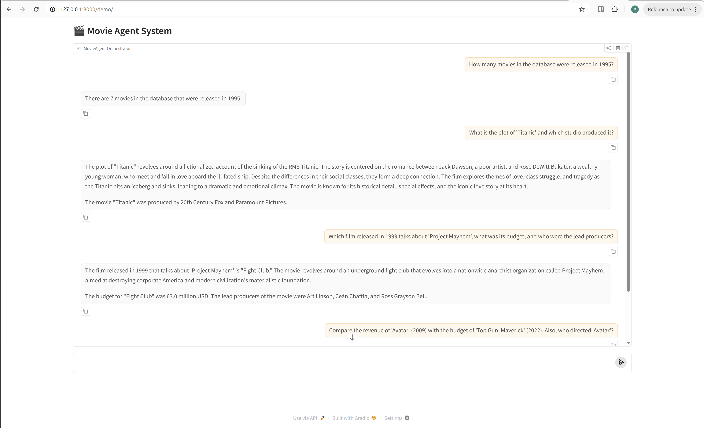

# Multi Agent Movie Intelligence system

A multi-agent movie intelligence system built with LangChain and LangGraph. This system orchestrates specialized agents to solve complex, multi-modal research tasks across SQL databases, PDF documents (RAG), and real-time web search.


## Setup & Installation

### 1. Prerequisites
- Python 3.12+
- `uv` (Recommended for high-performance dependency management)
- API Keys: `OPENAI_API_KEY`, `TAVILY_API_KEY`

### 2. Install Dependencies
```bash
uv sync
```

## Project Structure

- `movie_agents.py`: The core logic defining specialists and the supervisor.
- `rest_endpoints.py`: FastAPI server exposing the system via REST.
- `api_models.py`: Pydantic schemas used by FastAPI endpoints
- `chatbot_interface.py`: Gradio web interface for interactive research.
- `main.py`: The single entry point to launch both the API and UI.

## Running the System

To launch the complete integrated system (API + Chatbot):
```bash
uv run python src/main.py
```
- **Web UI**: Access at `http://127.0.0.1:8000/demo`
- **REST Documentation**: Access at `http://127.0.0.1:8000/docs`

## User Interface view

Users interact with the system through a chat-based interface. Each query is processed by a multi-agent backend that retrieves and combines results from multiple data sources.

